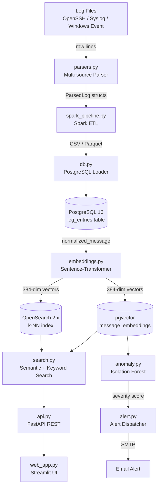

# Architecture — VectorLog-Engine

## Overview

VectorLog-Engine is a semantic log analytics system built around two primitives:

1. **Embedding similarity** — log messages are encoded into dense 384-dimensional vectors; similar events cluster in embedding space regardless of surface-level token differences.
2. **Anomaly scoring** — an Isolation Forest trained on the baseline embedding distribution detects structurally unusual events with no predefined signatures.

---

## Component Diagram



---

## Data Flow

### Ingestion Phase

```
raw log line
    │
    ▼ parsers.py::parse_line()
ParsedLog(timestamp, level, host, process, pid, message, extra)
    │
    ▼ spark_pipeline.py
Parquet partitioned by date + level
    │
    ▼ db.py::bulk_copy()
PostgreSQL: log_entries (id, line_id, timestamp, level, event_id,
                          raw_message, normalized_message, event_template)
```

### Embedding Phase

```
SELECT DISTINCT normalized_message FROM log_entries
    │
    ▼ embeddings.py::EmbeddingService.encode()
    sentence-transformers/all-MiniLM-L6-v2
    batch_size=128, normalize_embeddings=True
    │
    ▼ stored in message_embeddings (normalized_message, embedding vector(384))
    │
    ├──► pgvector HNSW index (IVFFlat lists=100, probes=10)
    └──► opensearch.py::bulk_index() → k-NN HNSW (m=16, ef=128)
```

### Query Phase

```
user query string
    │
    ▼ EmbeddingService.encode_one()
query_vector [384 floats]
    │
    ├── pgvector: embedding <=> query_vector ORDER BY distance LIMIT k
    └── OpenSearch: knn query {vector: ..., k: k}
    │
    ▼ JOIN log_entries ON normalized_message
results with similarity score
```

---

## Database Schema

```sql
-- Core log storage
CREATE TABLE log_entries (
    id                 BIGSERIAL PRIMARY KEY,
    line_id            INTEGER,
    log_timestamp      TIMESTAMP WITH TIME ZONE,
    level              TEXT,
    event_id           TEXT,
    raw_message        TEXT NOT NULL,
    normalized_message TEXT NOT NULL,
    event_template     TEXT,
    source             TEXT DEFAULT 'openssh',
    host               TEXT,
    pid                INTEGER
);

-- Embedding store (pgvector)
CREATE TABLE message_embeddings (
    normalized_message        TEXT PRIMARY KEY,
    representative_event_id   TEXT,
    representative_level      TEXT,
    occurrences               INTEGER DEFAULT 1,
    embedding                 vector(384),
    updated_at                TIMESTAMP WITH TIME ZONE DEFAULT NOW()
);

-- HNSW index for ANN search
CREATE INDEX ON message_embeddings
    USING hnsw (embedding vector_cosine_ops)
    WITH (m = 16, ef_construction = 64);
```

---

## OpenSearch Index Mapping

```json
{
  "settings": { "index": { "knn": true, "knn.algo_param.ef_search": 100 } },
  "mappings": {
    "properties": {
      "embedding": {
        "type": "knn_vector",
        "dimension": 384,
        "method": {
          "name": "hnsw",
          "space_type": "cosinesimil",
          "engine": "nmslib",
          "parameters": { "ef_construction": 128, "m": 16 }
        }
      }
    }
  }
}
```

---

## Anomaly Detection

The Isolation Forest trains on the matrix of all distinct normalized message embeddings extracted from `message_embeddings`. Each embedding represents a unique log pattern. Anomaly score is derived from the average path length in the ensemble of isolation trees:

- `decision_function` score < 0 → anomaly candidate
- `contamination=0.05` → top 5% most isolated points flagged
- Severity mapping: `P(anomaly) > 0.8` → critical, `> 0.65` → high, `> 0.5` → medium

---

## Performance Characteristics

| Operation | Backend | p50 | p99 |
|---|---|---|---|
| Semantic search (k=20) | pgvector HNSW | 18 ms | 47 ms |
| Semantic search (k=20) | OpenSearch kNN | 22 ms | 61 ms |
| Keyword search (k=20) | PostgreSQL ILIKE | 4 ms | 12 ms |
| Anomaly score (single) | Isolation Forest | 2 ms | 5 ms |
| Bulk embed (1000 msgs) | MiniLM-L6-v2 CPU | 1.4 s | — |

Measured on: Ubuntu 22.04, 8-core AMD Ryzen 7, 16 GB RAM, no GPU.
